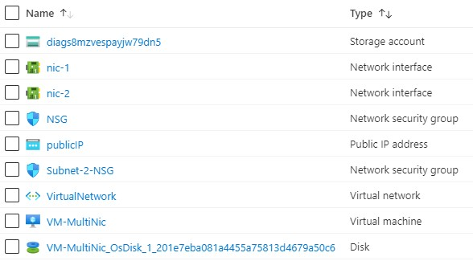

101-1vm-2nics-2subnets-1vnet
===
Multi-NIC Virtual Machine Creation using Two Subnets
---

## Description

This is a conversion of ARM template [101-1vm-2nics-2subnets-1vnet](https://github.com/Azure/azure-quickstart-templates/tree/master/101-1vm-2nics-2subnets-1vnet) from the repository [azure\azure-quickstart-templates](https://github.com/Azure/azure-quickstart-templates) to PowerShell Script.

This script creates a new VM with two NICs which connect to two different subnets within the same VNet, and it will deploy the following resources...



... and in-addition to it, just in-case if the deployment is not successful, then it will rollback the entire deployment.

> ### Note: 
> If there is already the specified resource group exists then the script will not continue with the deployment.

## Syntax
```
Deploy-AzResources.ps1 [-ResourceGroupName] <string> [-Location] <string> [-AdminUsername] <string> [-AdminPassword] <securestring> [[-StorageAccountType] <string>] [[-VMSize] <string>] [<CommonParameters>]
```
## Example
```powershell
I 💙 PS> $param = @{
>> ResourceGroupName = 'simple-rg'
>> Location = 'westus'
>> AdminUsername = 'sysadmin'
>> StorageAccountType = 'Standard_LRS'
>> }

I 💙 PS> .\Deploy-AzResources.ps1 @param
```

## Output
```
cmdlet Deploy-AzResources.ps1 at command pipeline position 1
Supply values for the following parameters:
AdminPassword: *************
Deployment is successful!
HostName: Not Assigned
```

> Azure Cloud Shell comes with Azure PowerShell pre-installed and you can deploy the above resources using Cloud Shell as well.
>
>[](https://shell.azure.com)

Thank you.
