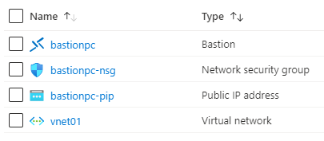

101-azure-bastion-nsg
===
Deploy Azure Bastion in an Azure Virtual Network
---

## Description

This is a conversion of ARM template [101-azure-bastion-nsg](https://github.com/Azure/azure-quickstart-templates/tree/master/101-azure-bastion-nsg) from the repository [azure\azure-quickstart-templates](https://github.com/Azure/azure-quickstart-templates) to PowerShell Script, and this script will deploy Azure Bastion in a new or existing VirtualNetwork which includes AzureBastionSubnet, Bastion Public IP, and NetworkSecurityGroup with necessary security rules. 



## Syntax
```
Deploy-AzResources.ps1 -VNetName <string> -BastionHostName <string> -BastionSubnetIPPrefix <string> [-ResourceGroupName <string>] [<CommonParameters>]

Deploy-AzResources.ps1 -ResourceGroupName <string> -Location <string> -VNetName <string> -VNetIPPrefix <string> -DefaultSubnetIPPrefix <string> -BastionHostName <string> -BastionSubnetIPPrefix <string> [<CommonParameters>]

```
## Example
```powershell
I 💙 PS> $param = @{
>> resourceGroupName = 'rgroup01'
>> location = 'westus'
>> VNetName = 'vnet01'
>> VNetIPPrefix = '10.0.0.0/16'
>> DefaultSubnetIPPrefix = '10.0.0.0/24'
>> BastionHostName = 'bastionpc'
>> BastionSubnetIPPrefix = '10.0.1.0/24'
>> }

I 💙 PS> .\Deploy-AzResources.ps1 @param
```

## Output
```
bastionpc is successfully deployed.
```

Thank you.
