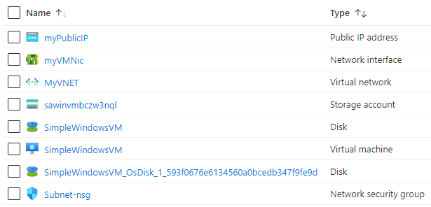

101-vm-secure-password
===
Very simple deployment of a Windows VM using password stored in Key Vault 
---

## Description

This is an Azure quickstart sample PowerShell script based on ARM template [101-vm-secure-password](https://github.com/Azure/azure-quickstart-templates/tree/master/101-vm-secure-password) from the repository [azure\azure-quickstart-templates](https://github.com/Azure/azure-quickstart-templates).

This script allows you to deploy a simple Windows VM by retrieving the password that is stored in a Key Vault. Therefore the password is never put in plain text in the script, and it will deploy the following resources...



> ### Key Vault reference 
> [https://docs.microsoft.com/en-us/azure/key-vault/secrets/quick-create-powershell#create-a-resource-group](https://docs.microsoft.com/en-us/azure/key-vault/secrets/quick-create-powershell#create-a-resource-group)

... and in-addition to it, just in-case if the deployment is not successful, then it will rollback the entire deployment.

> ### Note: 
> If the specified resource group is already exist then the script will not continue with the deployment.

## Syntax
```
Deploy-AzResource.ps1 [-ResourceGroupName] <string> [-Location] <string> [[-DNSLabelPrefix] <string>] [[-WindowsOSVersion] <string>] [[-VMSize] <string>] [-KeyVaultName] <string> [-AdminUserName] <string> [<CommonParameters>]
```

## Example
```powershell
I 💙 PS> $param = @{
>> ResourceGroupName = 'compute-rg'
>> Location = 'westus'
>> KeyVaultName = 'sgdhjk-kv'
>> AdminUserName = 'sysadmin'
>> }

I 💙 PS> .\Deploy-AzResources.ps1 @param
```

## Output
```
Deployment is successful!
```

> Azure Cloud Shell comes with Azure PowerShell pre-installed and you can deploy the above resources using Cloud Shell as well.
>
>[](https://shell.azure.com)

Thank you.

https://docs.microsoft.com/en-us/azure/key-vault/secrets/quick-create-powershell