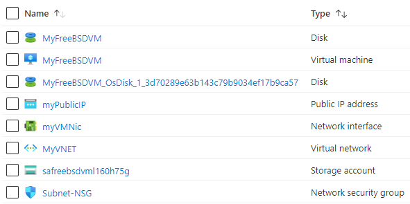

101-vm-simple-freebsd
===
Very simple deployment of an FreeBSD VM
---

## Description

This is a conversion of ARM template [101-vm-simple-freebsd](https://github.com/Azure/azure-quickstart-templates/tree/master/101-vm-simple-freebsd) from the repository [azure\azure-quickstart-templates](https://github.com/Azure/azure-quickstart-templates) to PowerShell Script.

This script allows you to deploy a simple FreeBSD VM using a few different options for the FreeBSD version, using the latest patched version. This will deploy a A1 size VM in the resource group location and return the FQDN of the VM, and it will deploy the following resources...



... and in-addition to it, just in-case if the deployment is not successful, then it will rollback the entire deployment.

> ### Note: 
> If the specified resource group is already exist then the script will not continue with the deployment.

## Syntax
```
Deploy-AzResource.ps1 -ResourceGroupName <string> -Location <string> -AdminUsername <string> -DNSLabelPrefix <string> [-FreeBSDOSVersion <string>] [-SSHKey <string>] [<CommonParameters>]

Deploy-AzResource.ps1 -ResourceGroupName <string> -Location <string> -AdminUsername <string> -DNSLabelPrefix <string> -AdminPassword <securestring> [-FreeBSDOSVersion <string>] [<CommonParameters>]
```

## Example
```powershell
I 💙 PS> $Key = Get-Content -Path ~\.ssh\id_rsa

I 💙 PS> $param = @{
>> ResourceGroupName = 'linux-rg'
>> Location = 'westus'
>> AdminUsername = 'sysadmin'
>> DNSLabelPrefix = 'linuxsdhjiu'
>> SSHKey = $Key
>> }

I 💙 PS> .\Deploy-AzResource.ps1 @param
```

## Output
```
HostName: linuxsdhjiu.westus.cloudapp.azure.com
SSH Command: ssh sysadmin@linuxsdhjiu.westus.cloudapp.azure.com
Deployment is successful!
```

> Azure Cloud Shell comes with Azure PowerShell pre-installed and you can deploy the above resources using Cloud Shell as well.
>
>[](https://shell.azure.com)

Thank you.
