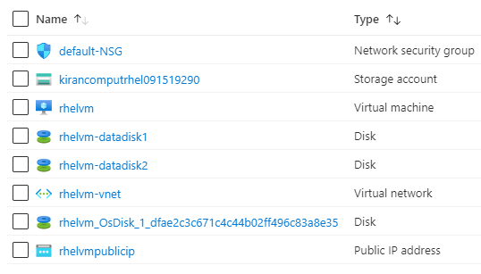

101-vm-simple-rhel
===
Deployment of Red Hat Enterprise Linux VM (RHEL 7.2 or RHEL 6.7)
---

## Description

This is an Azure quickstart sample PowerShell script based on ARM template [101-vm-simple-rhel](https://github.com/Azure/azure-quickstart-templates/tree/master/101-vm-simple-rhel) from the repository [azure\azure-quickstart-templates](https://github.com/Azure/azure-quickstart-templates).

This script allows deploying a Red Hat Enterprise Linux VM (RHEL 7.2 or RHEL 6.7), using the latest image for the selected RHEL version. This will deploy a Standard A2 VM in the location of your chosen resource group with an additional 100 GiB data disk attached to the VM, and it will deploy the following resources...



... and in-addition to it, just in-case if the deployment is not successful, then it will rollback the entire deployment.

> ### Note: 
> If the specified resource group is already exist then the script will not continue with the deployment.

## Syntax
```
Deploy-AzResource.ps1 [-ResourceGroupName] <string> [-Location] <string> [-VMName] <string> [-AdminUsername] <string> [[-Authenticationtype] <string>] [[-AdminPassword] <securestring>] [[-KeyFileName] <string>] [<CommonParameters>]
```

## Example
```powershell
I 💙 PS> $param = @{
>> ResourceGroupName = 'compute-rg'
>> Location = 'westus'
>> VMName = 'rhelvm'
>> AdminUsername = 'sysadmin'
>> Authenticationtype = 'sshPublicKey' 
>> KeyFileName = '~\.ssh\id_rsa.pub'
>> }

I 💙 PS> .\Deploy-AzResources.ps1 @param
```

## Output
```
Deployment is successful!
```

> Azure Cloud Shell comes with Azure PowerShell pre-installed and you can deploy the above resources using Cloud Shell as well.
>
>[](https://shell.azure.com)

Thank you.
