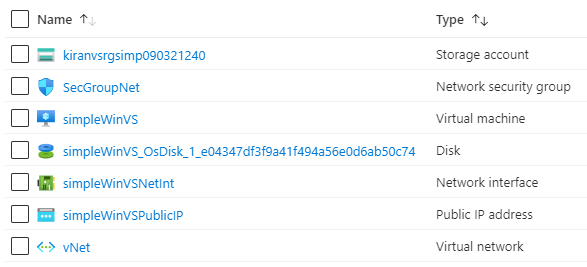

101-vm-simple-windows-visualstudio2019
===
Windows Server 2016 with Visual Studio 2019
---

## Description

This is a conversion of ARM template [101-vm-simple-windows-visualstudio2019](https://github.com/Azure/azure-quickstart-templates/tree/master/101-vm-simple-windows-visualstudio2019) from the repository [azure\azure-quickstart-templates](https://github.com/Azure/azure-quickstart-templates) to PowerShell Script.

This script deploys a Windows Server Datacenter 2016 VM with Visual Studio 2019 Community Edition, using the latest patched version. This will deploy a Standard_D2_v2 size VM in the resource group location and return the admin user name, networkSecurityGroupName, virtualNetworkName and hostname, and it will deploy the following resources...



## Syntax
```
Deploy-AzResource.ps1 [-ResourceGroupName] <string> [-Location] <string> [[-VMName] <string>] [[-VMSize] <string>] [-AdminCredential] <pscredential> [[-DNSLabelPrefix] <string>] [[-SharedResources] <string>] [[-VirtualNetworkName] <string>] [[-SubnetName] <string>] [[-NetworkSecurityGroupName] <string>] [<CommonParameters>]
```

## Example
```powershell
I 💙 PS> $Credential = Get-Credentials

PowerShell credential request
Enter your credentials.
User: sysadmin
Password for user sysadmin: *************

I 💙 PS> $param = @{
>> ResourceGroupName = 'vstest-rg'
>> Location = 'westus'
>> AdminCredential = $Credential
>> }

I 💙 PS> .\Deploy-AzResources.ps1 @param
```

## Output
```
Deployment is successful!

AdminUsername VirtualNetworkName NetworkSecurityGroupName Hostname
------------- ------------------ ------------------------ --------
sysadmin      vNet               SecGroupNet              simplewinvs-ureymk63.westus.cloudapp.azure.com
```

> Azure Cloud Shell comes with Azure PowerShell pre-installed and you can deploy the above resources using Cloud Shell as well.
>
>[](https://shell.azure.com)

Thank you.
