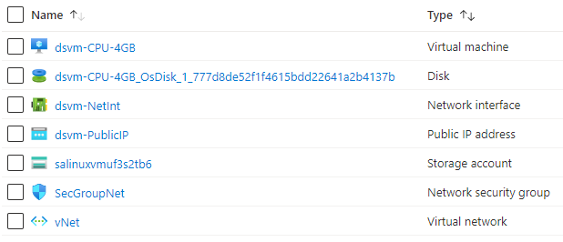

101-vm-ubuntu-DSVM-GPU-or-CPU
===
Data Science Linux Ubuntu 18.04
---

## Description

This is a conversion of ARM template [101-vm-ubuntu-DSVM-GPU-or-CPU](https://github.com/Azure/azure-quickstart-templates/tree/master/101-vm-ubuntu-DSVM-GPU-or-CPU) from the repository [azure\azure-quickstart-templates](https://github.com/Azure/azure-quickstart-templates) to PowerShell Script.

This script deploys a Linux VM Ubuntu with data science tools. This will deploy a CPU or GPU based VM in the resource group location and will return the admin user name, and it will deploy the following resources...



... and in-addition to it, just in-case if the deployment is not successful, then it will rollback the entire deployment.

> ### Note: 
> If the specified resource group is already exist then the script will not continue with the deployment.

## Syntax
```
Deploy-AzResource.ps1 [-ResourceGroupName] <string> [-Location] <string> [-AdminUsername] <string> [-VMName] <string> [[-CPUorGPU] <string>] [[-VirtualNetworkName] <string>] [[-SubnetName] <string>] [[-NetworkSecurityGroupName] <string>] [[-AuthenticationType] <string>] [-AdminPassword] <securestring> [<CommonParameters>]
```

## Example
```powershell
I 💙 PS> $param = @{
>> ResourceGroupName = 'dsvm-rg'
>> Location = 'westus'
>> AdminUsername = 'sysadmin'
>> VMName = 'dsvm'
>> }

I 💙 PS> .\Deploy-AzResources.ps1 @param

cmdlet Deploy-AzResource.ps1 at command pipeline position 1
Supply values for the following parameters:
AdminPassword: **************
```

## Output
```
AdminUsername: sysadmin
Deployment is successful!
```

> Azure Cloud Shell comes with Azure PowerShell pre-installed and you can deploy the above resources using Cloud Shell as well.
>
>[](https://shell.azure.com)

Thank you.
