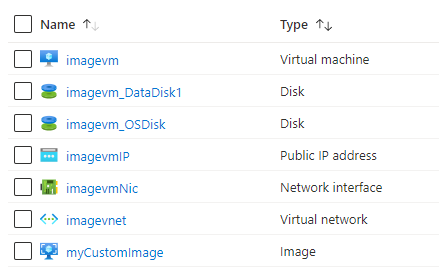

101-vm-user-image-data-disks
===
Create a Virtual Machine from a User Image
---

## Description

This is a conversion of ARM template [101-vm-user-image-data-disks](https://github.com/Azure/azure-quickstart-templates/tree/master/101-vm-user-image-data-disks) from the repository [azure\azure-quickstart-templates](https://github.com/Azure/azure-quickstart-templates) to PowerShell Script.

> Prerequisite - The VHDs to be used for OS and data disks must be stored as page blob in an Azure Resource Manager storage account.

This script allows you to create virtual machines from the specified VHDs for OS and data disks. The disks used for your VM will be based on copies of the VHDs you specify in the template parameters. This script first creates a managed image using the specified OS and data VHDs. Then, it creates a VM using the managed image. This script also deploys a Virtual Network, Public IP addresses and a Network Interface in a user specified resource group, and it will deploy the following resources...



... and in-addition to it, just in-case if the deployment is not successful, then it will rollback the entire deployment.

> ### Note: 
> If the specified resource group is already exist then the script will not continue with the deployment.

## Syntax
```
Deploy-AzResource.ps1 -ResourceGroupName <string> -Location <string> -VMName <string> -BootDiagnosticsStorageAccountName <string> -BootDiagnosticsStorageAccountResourceGroupName <string> -OSDiskVhdUri <string> -DataDiskVhdUri <string> -DNSLabelPrefix <string> -AdminCredential <pscredential> -OSType <string> -VMSize <string> -NewVNetName <string> -NewSubnetName <string> [-DiskStorageType <string>] [<CommonParameters>]

Deploy-AzResource.ps1 -ResourceGroupName <string> -Location <string> -VMName <string> -BootDiagnosticsStorageAccountName <string> -BootDiagnosticsStorageAccountResourceGroupName <string> -OSDiskVhdUri <string> -DataDiskVhdUri <string> -DNSLabelPrefix <string> -AdminCredential <pscredential> -OSType <string> -VMSize <string> -ExistingVNetName <string> -ExistingSubnetName <string> -ExistingVnetResourceGroupName <string> [-DiskStorageType <string>] [<CommonParameters>]
```

## Example
```powershell
I 💙 PS> $Credential = Get-Credentials

PowerShell credential request
Enter your credentials.
User: sysadmin
Password for user sysadmin: *************

I 💙 PS> $param = @{
>> ResourceGroupName = 'test-rg'
>> Location = 'westus'
>> VMName = 'psimagevm' 
>> BootDiagnosticsStorageAccountName = 'sabootsdukhi'
>> BootDiagnosticsStorageAccountResourceGroupName = 'pstest-rg'
>> OSDiskVhdUri = 'https://sal0agr68m.blob.core.windows.net/vhds/azvmimage.vhd'
>> DataDiskVhdUri = 'https://sal0agr68m.blob.core.windows.net/vhds/imgdatadisk.vhd' 
>> DNSLabelPrefix = 'imagejkbhsds'
>> AdminCredential = $Credential
>> OSType = 'Windows'
>> VMSize = 'Standard_D2_V2'
>> NewVNetName = 'imagevnet' 
>> NewSubnetName = 'subnet'
>> }

I 💙 PS> .\Deploy-AzResources.ps1 @param
```

## Output
```
Deployment is successful!
```

> Azure Cloud Shell comes with Azure PowerShell pre-installed and you can deploy the above resources using Cloud Shell as well.
>
>[](https://shell.azure.com)

Thank you.
