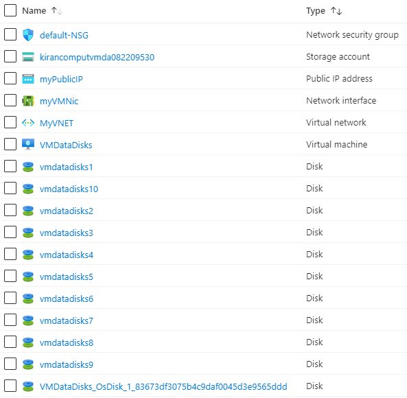

101-vm-windows-copy-datadisks
===
Windows VM deployment with a variable number of data disks
---

## Description

This is a conversion of ARM template [101-vm-windows-copy-datadisks](https://github.com/Azure/azure-quickstart-templates/tree/master/101-vm-windows-copy-datadisks) from the repository [azure\azure-quickstart-templates](https://github.com/Azure/azure-quickstart-templates) to PowerShell Script.

This script allows you to deploy a simple VM and specify the number of data disks at deploy time using a parameter. Note that the number and size of data disks is bound by the VM size, this sample does not attempt to enforce those rules beyond the size used in this sample, and it will deploy the following resources...



... and in-addition to it, just in-case if the deployment is not successful, then it will rollback the entire deployment.

> ### Note: 
> If the specified resource group is already exist then the script will not continue with the deployment.

## Syntax
```
Deploy-AzResource.ps1 [-ResourceGroupName] <string> [-Location] <string> [-DNSLabelPrefix] <string> [[-OSVersion] <string>] [[-NumberOfDataDisks] <int>] [-AdminCredential] <pscredential> [<CommonParameters>]
```

## Example
```powershell
I 💙 PS> $Credential = Get-Credentials

PowerShell credential request
Enter your credentials.
User: sysadmin
Password for user sysadmin: *************

I 💙 PS> $param = @{
>> ResourceGroupName = 'test-rg'
>> Location = 'westus'
>> DNSLabelPrefix = 'vmwithdatadisks10'
>> NumberOfDataDisks = 10
>> AdminCredential = $Credential
>> }

I 💙 PS> .\Deploy-AzResources.ps1 @param
```

## Output
```
Deployment is successful!
vmwithdatadisks10.westus.cloudapp.azure.com
```

> Azure Cloud Shell comes with Azure PowerShell pre-installed and you can deploy the above resources using Cloud Shell as well.
>
>[](https://shell.azure.com)

Thank you.
