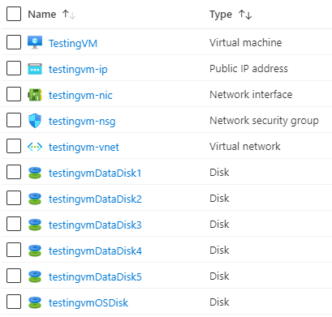

101-vm-with-standardssd-disk
===
Create a Virtual Machine from a Windows Image with multiple empty Standard SSD Data Disks
---

## Description

This is a conversion of ARM template [101-vm-with-standardssd-disk](https://github.com/Azure/azure-quickstart-templates/tree/master/101-vm-with-standardssd-disk) from the repository [azure\azure-quickstart-templates](https://github.com/Azure/azure-quickstart-templates) to PowerShell Script.

This script allows you to create a Windows Virtual Machine from a specified image during the template deployment. It also attaches multiple empty Standard SSD data disks. Note that you can specify the size of each of the empty data disks. This template also deploys a Virtual Network, Public IP addresses and a Network Interface, and it will deploy the following resources...



... and in-addition to it, just in-case if the deployment is not successful, then it will rollback the entire deployment.

> ### Note: 
> If the specified resource group is already exist then the script will not continue with the deployment.

## Syntax
```
Deploy-AzResource.ps1 [-ResourceGroupName] <string> [-Location] <string> [-VirtualMachineName] <string> [-AdminCredential] <pscredential> [[-DiskType] <string>] [[-VirtualMachineSize] <string>] [[-WindowsOSVersion] <string>] [<CommonParameters>]
```

## Example
```powershell
I 💙 PS> $Credential = Get-Credentials

PowerShell credential request
Enter your credentials.
User: sysadmin
Password for user sysadmin: *************

I 💙 PS> $param = @{
>> ResourceGroupName = 'testing-rg'
>> Location = 'westus'
>> VirtualMachineName = 'TestingVM'
>> AdminCredential = $Credential
>> }

I 💙 PS> .\Deploy-AzResources.ps1 @param
```

## Output
```
Deployment is successful!
```

> Azure Cloud Shell comes with Azure PowerShell pre-installed and you can deploy the above resources using Cloud Shell as well.
>
>[](https://shell.azure.com)

Thank you.
