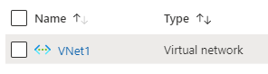
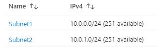

101-vnet-two-subnets
===
Virtual Network with two Subnets
---

## Description

This is a conversion of ARM template [101-vnet-two-subnets](https://github.com/Azure/azure-quickstart-templates/tree/master/101-vnet-two-subnets) from the repository [azure\azure-quickstart-templates](https://github.com/Azure/azure-quickstart-templates) to PowerShell Script.

This script allows you to create a Virtual Network with two subnets, and it will deploy following the resources...

### Virtual Network


### Subnets


... and in-addition to it, just in-case if the deployment is not successful, then it will rollback the entire deployment.

> ### Note: 
> If the specified resource group is already exist then the script will not continue with the deployment.

## Syntax
```
Deploy-AzResource.ps1 [-ResourceGroupName] <string> [-Location] <string> [[-VNetName] <string>] [[-VNetAddressSpace] <string>] [[-Subnet1Name] <string>] [[-Subnet1Prefix] <string>] [[-Subnet2Name] <string>] [[-Subnet2Prefix] <string>] [<CommonParameters>]
```

## Example
```powershell
I 💙 PS> $param = @{
>> ResourceGroupName = 'vnet-test-rg'
>> Location = 'westus'
>> }

I 💙 PS> .\Deploy-AzResources.ps1 @param
```

## Output
```
Deployment is successful!
```

> Azure Cloud Shell comes with Azure PowerShell pre-installed and you can deploy the above resources using Cloud Shell as well.
>
>[](https://shell.azure.com)

Thank you.
