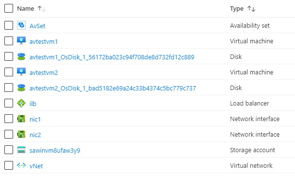

201-2-vms-internal-load-balancer
===
Create 2 Virtual Machines under an Internal Load balancer and configures Load Balancing rules for the VMs
---

## Description

This is a conversion of ARM template [201-2-vms-internal-load-balancer](https://github.com/Azure/azure-quickstart-templates/tree/master/201-2-vms-internal-load-balancer) from the repository [azure\azure-quickstart-templates](https://github.com/Azure/azure-quickstart-templates) to PowerShell Script, and this script will deploy following the resources...



... and in-addition to it, just in-case if the deployment is not successful, then it will rollback the entire deployment.

> ### Note: 
> If the specified resource group is already exist then the script will not continue with the deployment.

## Syntax
```
Deploy-AzResource.ps1 [-ResourceGroupName] <string> [-Location] <string> [-AdminCredential] <pscredential> [[-VMNamePrefix] <string>] [<CommonParameters>]
```

## Example
```powershell
I 💙 PS> $Credential = Get-Credentials

PowerShell credential request
Enter your credentials.
User: sqladmin
Password for user sqladmin: *************

I 💙 PS> $param = @{
>> ResourceGroupName = 'azsqldb-rg'
>> Location = 'westus'
>> AdminCredential = $Credential
>> }

I 💙 PS> .\Deploy-AzResources.ps1 @param
```

## Output
```
Deployment is successful!
```

> Azure Cloud Shell comes with Azure PowerShell pre-installed and you can deploy the above resources using Cloud Shell as well.
>
>[](https://shell.azure.com)

Thank you.
